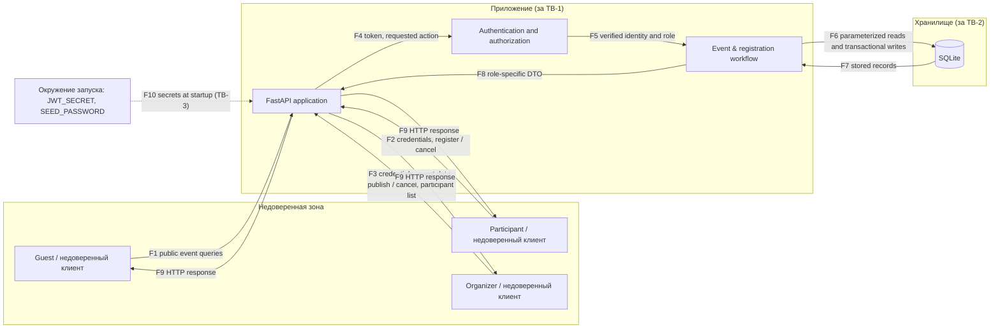

# Модель угроз

## Модель продукта

Campus Events — небольшой Web API регистрации на мероприятия, описанный в [PROJECT.md](PROJECT.md). В области модели находятся аутентификация, мероприятия и их состояния, вместимость, регистрации, список участников и журнал значимых изменений.

**Компоненты:**

| Компонент | Назначение | Файл |
| --- | --- | --- |
| HTTP-клиент (Guest, Participant, Organizer) | Отправляет недоверенный ввод и получает ответы; Swagger UI, curl, scripts/demo.py | — |
| FastAPI application | Точка входа, валидация схем, маршрутизация | app/main.py, app/schemas.py |
| Authentication and authorization | Проверка JWT, загрузка пользователя и роли из БД, проверка отношения к объекту | app/security.py, app/dependencies.py, app/services.py |
| Event & registration workflow | Команды публикации и отмены, атомарная регистрация, вместимость, журнал | app/services.py |
| SQLite | Постоянное хранение через SQLAlchemy, ограничения CHECK и частичный уникальный индекс | app/models.py, app/database.py |

**Схема потоков**:

| Поток | Что передаётся |
| --- | --- |
| F1 | Запросы списка и карточек опубликованных мероприятий, limit/offset |
| F2 | Логин и пароль, токен, команды регистрации и отмены своей регистрации |
| F3 | Логин и пароль, токен, данные мероприятия, команды publish/cancel, запросы списка участников и журнала |
| F4–F5 | Токен → проверенная идентичность и роль из БД |
| F6–F7 | Параметризованные запросы; связанные изменения (счётчик, регистрация, журнал) в одной транзакции |
| F8–F9 | DTO по роли: EventPublic, EventOrganizerRead, RegistrationRead, ParticipantRead |
| F10 | Секрет подписи токенов и пароль учебных аккаунтов из переменных окружения |

**Точки входа:**

- без аутентификации: GET /health, GET /events, GET /events/{id}, POST /auth/login, /docs;
- Organizer: POST /events, PATCH /events/{id}, POST /events/{id}/publish, POST /events/{id}/cancel, GET /my/events, GET /events/{id}/participants, GET /events/{id}/audit;
- Participant: POST /events/{id}/registrations, GET /my/registrations, POST /registrations/{id}/cancel;
- параметры маршрута {id} и параметры запроса limit/offset во всех перечисленных endpoint;
- переменные окружения при старте приложения.

**Что уже существует:**

- код минимальной технической основы: все перечисленные компоненты и endpoint;
- автоматизированные позитивные и негативные тесты в tests/test_app.py и tests/test_edge_cases.py, включая два конкурентных сценария регистрации;
- сквозной демонстрационный сценарий scripts/demo.py;
- фактическая проверка 2026-10-06 на Python 3.13.3: `python -m pytest` — 29 passed, 100% строк и ветвей приложения; `python scripts/demo.py` — 26/26 проверок PASS. Перед защитой результат повторяется на зафиксированной оцениваемой версии.

**Что пока планируется:**

- список ожидания и модерация публикаций (вне EK1);
- проверка работы на PostgreSQL (механизм условного UPDATE переносим, но не проверен);
- frontend, уведомления, внешние интеграции в продукт не входят.

**Существенные допущения:**

- используются только учебные аккаунты и вымышленные данные;
- учебные аккаунты создаются при старте приложения, публичной регистрации аккаунтов нет;
- приложение запускается локально; HTTPS за пределами локального стенда не является функцией приложения;
- время начала мероприятия сравнивается с часами сервера в UTC, время клиента не используется;
- администратор БД и оператор локального компьютера находятся за пределами модели нарушителя;
- защита от распределённого отказа в обслуживании инфраструктурного уровня не входит в ядро, но ограничения размера входа и пагинация остаются в области API.

**Нарушители:** неаутентифицированный клиент; аутентифицированный Participant, пытающийся получить данные других участников, обойти вместимость или полномочия организатора; аутентифицированный Organizer, пытающийся управлять чужими мероприятиями; клиент с украденным или подделанным токеном.

## Границы доверия

| Граница | Что пересекает | Почему требуется проверка |
| --- | --- | --- |
| TB-1: недоверенный HTTP-клиент / API | Учётные данные, токен, идентификаторы мероприятий и регистраций, данные мероприятия, команды publish/cancel/register, параметры limit/offset | Клиент полностью управляет запросом: может подставить чужой ID, поле owner_id, participant_id, role, status или reserved, подделать токен, отправить параллельные запросы. Сервер обязан сам установить идентичность и проверить право на конкретный объект и действие |
| TB-2: приложение / хранилище | Параметризованные запросы, транзакционные изменения счётчика, регистраций и журнала; сохранённые записи | Хранилище доверяет приложению, поэтому инварианты (вместимость, единственность регистрации) нельзя оставлять только проверке в коде: при конкуренции проверка и запись должны быть атомарны, а БД — отклонять нарушения ограничениями. Внутренние ошибки БД не должны уходить клиенту |
| TB-3: окружение запуска / приложение | JWT_SECRET, SEED_PASSWORD, DATABASE_URL | Слабый или отсутствующий секрет позволяет подделывать токены. Приложение проверяет наличие и длину секретов при старте и не запускается без них; значения не хранятся в Git |

## Значимые объекты и свойства

Подробное описание объектов и последствий нарушения — [PROJECT.md, раздел 5](PROJECT.md).

| Объект | Защищаемое свойство |
| --- | --- |
| Мероприятие и его состояние | Целостность: менять может только владелец и только допустимыми командами; конфиденциальность черновика |
| Регистрации и список участников | Конфиденциальность персональных данных участников; целостность: отменить регистрацию может только её владелец или отмена мероприятия |
| Вместимость и счётчик занятых мест | Целостность: активных регистраций не больше мест, в том числе при конкуренции |
| Учётная запись и роль | Подлинность: идентичность и роль определяются только сервером; конфиденциальность паролей и секрета |
| Журнал значимых изменений | Целостность и подотчётность: фактический автор действия, отсутствие изменения через API |

## Угрозы

| ID | Сценарий угрозы | Что нарушается | Граница / точка входа | Связанные SR | Приоритет и обоснование |
| --- | --- | --- | --- | --- | --- |
| T-01 | Несколько участников (или один нарушитель с несколькими аккаунтами) одновременно регистрируются на последнее место; проверка «есть ли место» и вставка выполняются раздельно, все запросы видят свободное место | Вместимость мероприятия: регистраций больше, чем мест | TB-1, TB-2 / POST /events/{id}/registrations | [SR-04](SECURITY-REQUIREMENTS.md#sr-04), [SR-05](SECURITY-REQUIREMENTS.md#sr-05) | **Высокий, входит в приоритетный набор.** Не требует особых прав, легко воспроизводится скриптом, нарушает центральную предметную гарантию продукта |
| T-02 | Participant, другой Organizer или аноним получает список участников: общий сериализатор включает связь registrations в публичный ответ, либо endpoint списка проверяет только роль Organizer, но не владение | Конфиденциальность имён и учебных email участников | TB-1 / GET /events/{id}, GET /events/{id}/participants | [SR-03](SECURITY-REQUIREMENTS.md#sr-03) | **Высокий, входит в приоритетный набор.** Опасность возникает даже при законном доступе к карточке мероприятия и вероятна при повторном использовании одной модели ответа |
| T-03 | Organizer B изменяет, публикует или отменяет мероприятие Organizer A по его ID; Participant B отменяет регистрацию Participant A по её ID | Целостность чужого мероприятия и регистрации; доступность места для законного участника | TB-1 / PATCH /events/{id}, POST /events/{id}/cancel, POST /registrations/{id}/cancel | [SR-02](SECURITY-REQUIREMENTS.md#sr-02) | **Высокий, входит в приоритетный набор.** Идентификаторы последовательны и видны клиенту, ущерб затрагивает других пользователей |
| T-04 | Клиент подставляет чужой participant_id или owner_id, заявляет роль Organizer в теле запроса, использует токен с неверной подписью или истёкшим сроком | Подлинность идентичности и роли; все последующие проверки полномочий | TB-1 / все защищённые endpoint, POST /auth/login | [SR-01](SECURITY-REQUIREMENTS.md#sr-01), [SR-08](SECURITY-REQUIREMENTS.md#sr-08) | **Высокий, входит в приоритетный набор.** Успешная эксплуатация разрушает основу всех остальных проверок доступа |
| T-05 | Клиент регистрируется на черновик, отменённое или начавшееся мероприятие; повторно регистрируется; передаёт status напрямую; уменьшает вместимость ниже числа участников | Согласованность состояний мероприятия и регистраций | TB-1 / POST /events/{id}/registrations, PATCH /events/{id}, publish/cancel | [SR-05](SECURITY-REQUIREMENTS.md#sr-05), [SR-04](SECURITY-REQUIREMENTS.md#sr-04) | Средний. Нарушение искажает основной процесс, но правила детерминированы и закрываются тем же механизмом, что и T-01 |
| T-06 | Клиент отправляет неверные типы, вместимость 0 или огромную, дату в прошлом или без часового пояса, очень длинные строки, SQL-метасимволы, огромный limit | Целостность данных, доступность API | TB-1 / POST и PATCH /events, GET /events | [SR-06](SECURITY-REQUIREMENTS.md#sr-06) | Средний. Ввод доступен всем, но Pydantic-схемы и ORM снимают большую часть последствий |
| T-07 | Пароль, токен или секрет подписи попадает в БД в открытом виде, журнал, ответ API или Git; приложение запускается со слабым секретом | Конфиденциальность учётных данных; возможность выпуска поддельных токенов | TB-3, TB-2 / POST /auth/login, конфигурация | [SR-08](SECURITY-REQUIREMENTS.md#sr-08), [SR-01](SECURITY-REQUIREMENTS.md#sr-01) | Средний до проверки конфигурации; повысить до высокого, если секреты обнаружены в репозитории или логах |
| T-08 | Участник утверждает, что не отменял регистрацию; клиент задаёт чужого автора записи журнала или пытается изменить/удалить журнал; отмена вместе с мероприятием неотличима от отмены участником | Подотчётность: невозможно установить автора действия | TB-1 / изменяющие endpoint, GET /events/{id}/audit | [SR-07](SECURITY-REQUIREMENTS.md#sr-07) | Средний. Не меняет само мероприятие, но мешает разбору спорных ситуаций |
| T-09 | Аноним или другой пользователь по прямому ID получает черновик; разные ответы для «нет» и «чужой» позволяют перебором установить существование черновиков; исключение возвращает SQL или стек | Конфиденциальность черновиков и внутреннего устройства | TB-1, TB-2 / GET /events/{id}, ошибки сервера | [SR-02](SECURITY-REQUIREMENTS.md#sr-02), [SR-03](SECURITY-REQUIREMENTS.md#sr-03) | Низкий/средний. Зависит от единообразия ответов и режима отладки |
